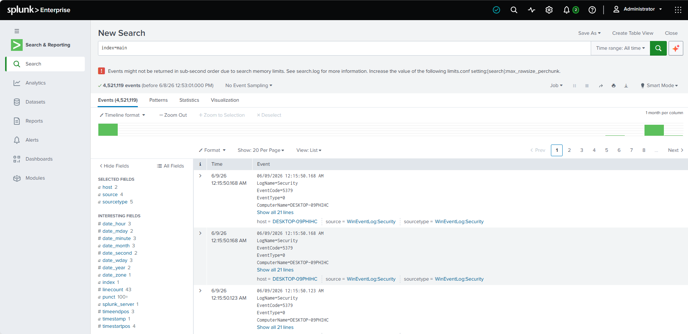
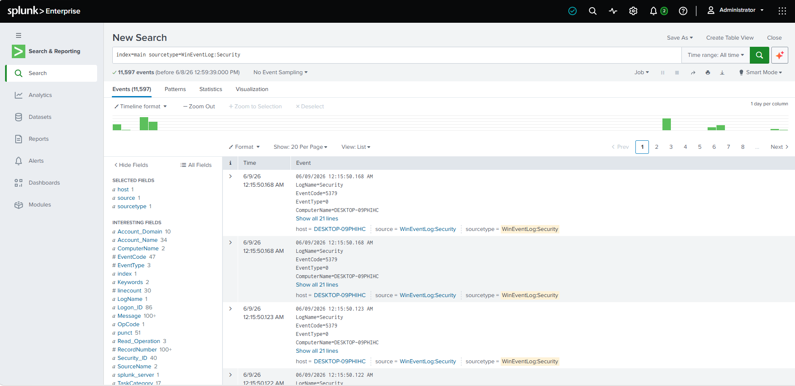
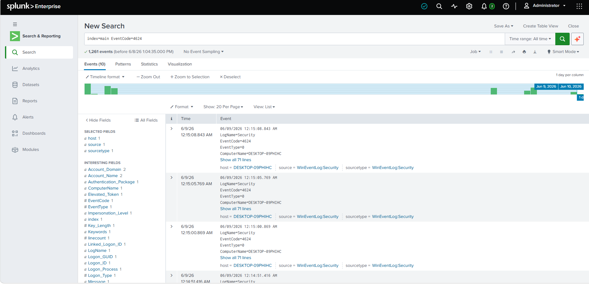
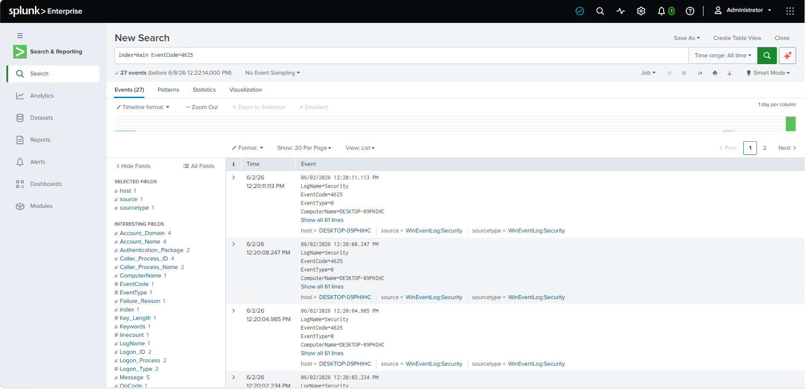
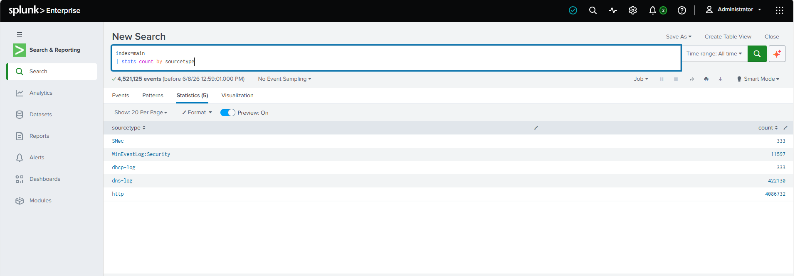
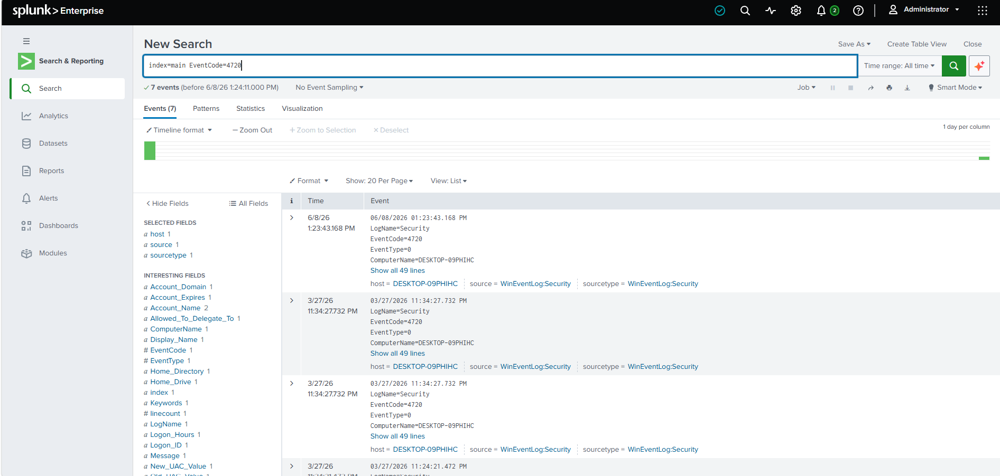
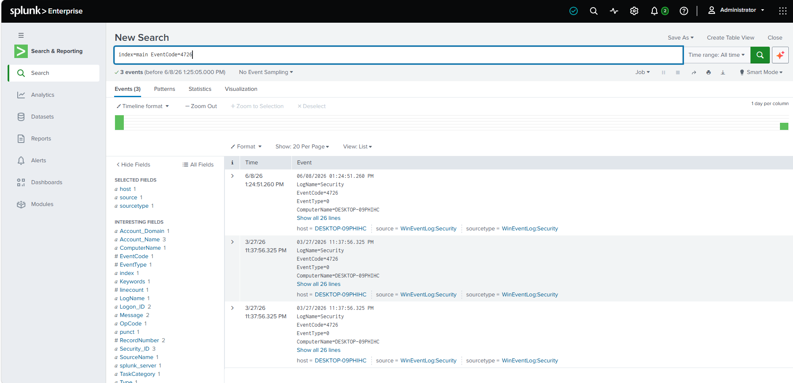

# 🛡️ SOC-Lab

# Windows Security Monitoring and Incident Investigation using Splunk

## Overview

This project demonstrates the implementation of a basic Security Operations Center (SOC) lab using **Splunk Enterprise**, **Splunk Universal Forwarder**, and a **Windows Virtual Machine**.

The objective of this project is to centralize Windows Security Event Logs, monitor authentication activities, and investigate security-related events using Splunk Enterprise as a Security Information and Event Management (SIEM) platform.

Windows Security Event Logs are forwarded to Splunk Enterprise using Splunk Universal Forwarder and analyzed using Splunk Search Processing Language (SPL). This project provides hands-on experience in log collection, security monitoring, authentication analysis, and basic incident investigation.

---

# Lab Architecture

```text
           Windows Virtual Machine
      (Windows Security Event Logs)
                    │
                    │
     Splunk Universal Forwarder
                    │
              TCP Port 9997
                    │
                    ▼
           Splunk Enterprise
              (index=main)
                    │
      Search • Investigation • Analysis
```

---

# Technologies Used

- Splunk Enterprise
- Splunk Universal Forwarder
- Windows Virtual Machine
- Windows Event Viewer
- Windows Security Event Logs
- Splunk Search Processing Language (SPL)

---

# Project Objectives

- Install and configure Splunk Enterprise.
- Configure Splunk Universal Forwarder.
- Collect Windows Security Event Logs.
- Forward logs to Splunk Enterprise.
- Monitor Windows authentication events.
- Analyze Windows Security Event IDs.
- Perform log analysis using SPL.
- Practice basic SOC investigation techniques.

---

# Windows Security Events Monitored

| Event ID | Description |
|----------|-------------|
| 4624 | Successful Logon |
| 4625 | Failed Logon |
| 4720 | User Account Created |
| 4726 | User Account Deleted |

---

# Splunk Searches Performed

## View All Indexed Events

```spl
index=main
```

**Output**



---

## Windows Security Logs

```spl
index=main sourcetype=WinEventLog:Security
```

**Output**



---

## Successful Login Events

```spl
index=main EventCode=4624
```

**Output**



---

## Failed Login Events

```spl
index=main EventCode=4625
```

**Output**



---

## Count Events by Sourcetype

```spl
index=main
| stats count by sourcetype
```

**Output**



---

## Failed Login Count by User

```spl
index=main EventCode=4625
| stats count by Account_Name
```

**Output**


---

## Failed Login Investigation

```spl
index=main EventCode=4625
| table _time host Account_Name Source_Network_Address
```

**Output**


---

## User Account Created

```spl
index=main EventCode=4720
```

**Output**



---

## User Account Deleted

```spl
index=main EventCode=4726
```

**Output**



# Screenshots

The repository contains screenshots demonstrating:

- Splunk Enterprise Search & Reporting
- Windows Security Event Log Collection
- All Indexed Events (`index=main`)
- Windows Security Logs (`sourcetype=WinEventLog:Security`)
- Successful Logon (Event ID 4624)
- Failed Logon (Event ID 4625)
- Event Count by Sourcetype
- Failed Login Count by User
- Failed Login Investigation
- User Account Creation (Event ID 4720)
- User Account Deletion (Event ID 4726)

---

# Repository Structure

```text
SOC-Lab/
│
├── README.md
│
├── screenshots/
│   ├── 01_index_main.png
│   ├── 02_security_logs.png
│   ├── 03_stats_sourcetype.png
│   ├── 04_eventcode_4624.png
│   ├── 05_eventcode_4625.png
│   ├── 06_failed_login_table.png
│   ├── 07_failed_login_stats.png
│   ├── 08_eventcode_4720.png
│   └── 09_eventcode_4726.png
│
├── splunk_queries/
│   └── queries.md
│
└── reports/
    └── investigation_notes.md
```

# Conclusion

This project demonstrates the implementation of a basic SIEM environment using Splunk Enterprise to collect, monitor, and analyze Windows Security Event Logs. By forwarding logs through Splunk Universal Forwarder and investigating authentication events using SPL queries, this project showcases foundational SOC Analyst skills in log collection, security monitoring, event analysis, and incident investigation.

---
